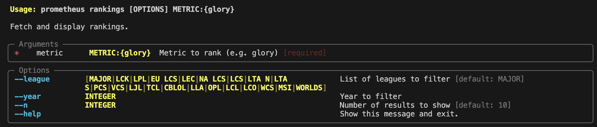
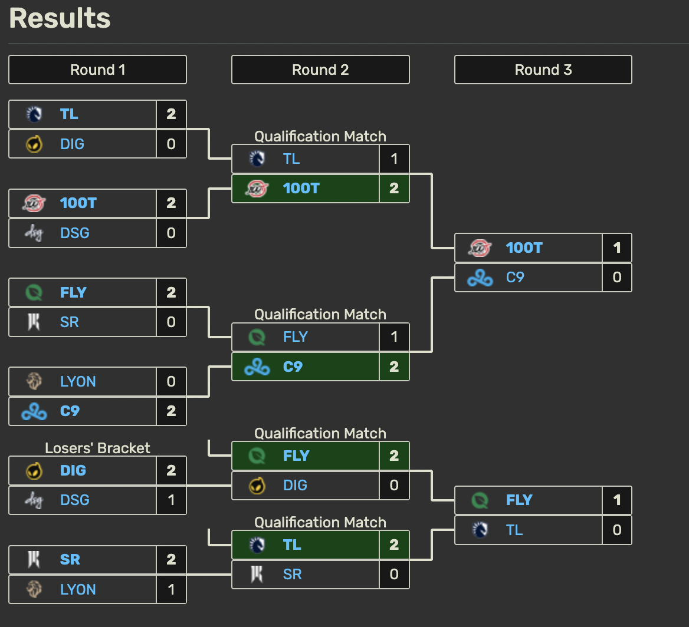

# Prometheus

Prometheus is a database of 'sabermetric' like stats that evaluate League of Legends esports teams and players. The `prometheus` repository will contain a database that records these stats as well as a self-hosted website to browse stats across different teams, seasons, and regions.

An overview of prometheus' stats (described more in the [metrics](#metrics) section). They come in two families. **Season stats** describe a team-season with hindsight and are judged on how stable they are and how well they match that season's results. **Forecasts** predict the next game from earlier games only and are judged by a backtest. No forecast uses a season stat as input.

Season stats:
- **Global League Offensive Rankings Yield (GLORY)**: Prometheus' flagship metric. How well a team played: gold/objective stats weighted by their importance in that year's meta, with every game adjusted for the opponent's strength over the season.
- **Record** (sunset; still used inside GLORY): what a team achieved: its results over the season, adjusted for schedule, with fast wins counting for more.
- **Luck** (sunset): wins above what a team's play earned.

Forecasts:
- **Game-length Elo**: a rating for every team in every region, built from player ratings (a team's Elo is the average of its five starters, so ratings follow players through roster moves). Fast wins move it more, and international results move a shared league offset, so a whole region rises or falls with how its teams do abroad.
- **Player Elo**: the player ratings behind team Elo, on their own register and one page per player (Elo after every game, career by team). Teammates move together, so it follows a player's teams through a career rather than splitting credit within a team.
- **FORGE** (Form + Elo, formerly GlorELO+): the headline forecast of who wins the next game. Elo plus Form, a team's recent, opponent-adjusted stats weighted to predict the next game and compared with its own league.

Sunset: **Form** (folded into FORGE; alone it predicts no better than Elo), **GLORB** (equal-weight baseline for GLORY; predicts no better than win % so far), **GLORY+** (folded into GLORY), and the unadjusted GLORY.
## CLI
The prometheus CLI provides users the ability to view past of current ratings for any of prometheus' metrics.



For example, the following command will show the top rankings of the `GLORY` metric for all major regions in a given year.

```
$ prometheus rankings glory --league MAJOR --year 2024
┏━━━━━━━━━━━━━━━━━━━━━━━━━━━━━━━━━━━━━━━━━━━━┓
┃ GLORY Rankings (MAJOR | [2024])            ┃
┡━━━━━━━━━━━━━━━━━━━━━━━━━━━━━━━━━━━━━━━━━━━━┩
│               teamname  score  year league │
│ 0                Gen.G  83.60  2024    LCK │
│ 1           G2 Esports  77.11  2024    LEC │
│ 2          Team Liquid  70.83  2024    LCS │
│ 3                   T1  65.70  2024    LCK │
│ 4  Hanwha Life Esports  65.46  2024    LCK │
│ 5               Fnatic  60.97  2024    LEC │
│ 6             FlyQuest  60.41  2024    LCS │
│ 7             Team BDS  57.71  2024    LEC │
│ 8               Cloud9  53.86  2024    LCS │
│ 9            Dplus KIA  53.51  2024    LCK │
└────────────────────────────────────────────┘
```

Provide lists of arguments to filter results for all of those parameters. Years also take inclusive ranges, so `--year 2021-2023` is the same as `--year 2021 --year 2022 --year 2023`.

The metric can be `glory`, `record`, `luck`, `forge`, `form` or the sunset `glorb`. Forecasts (`forge`, `form`) show current ratings by default; with `--year`, they show ratings at the end of each season:

```
$ prometheus rankings forge --year 2019-2020 --league LCK --n 3
│         teamname  forge   form     elo  year league │
│ 0      Dplus Kia  2195.17 385.24 1809.93  2020    LCK │
│ 1  SK Telecom T1  2010.18 256.74 1753.43  2019    LCK │
│ 2          Gen.G  1950.90 245.71 1705.19  2020    LCK │
```

```
$ prometheus rankings glory --year 2021 --year 2022 --league LPL --league LCK

┏━━━━━━━━━━━━━━━━━━━━━━━━━━━━━━━━━━━━━━━━━━━━┓
┃ GLORY Rankings (LPL, LCK | [2021, 2022])   ┃
┡━━━━━━━━━━━━━━━━━━━━━━━━━━━━━━━━━━━━━━━━━━━━┩
│               teamname  score  year league │
│ 0                Gen.G  77.18  2022    LCK │
│ 1      FunPlus Phoenix  76.00  2021    LPL │
│ 2  Royal Never Give Up  74.74  2021    LPL │
│ 3          Top Esports  74.40  2021    LPL │
│ 4                   T1  72.67  2022    LCK │
│ 5            Dplus KIA  72.38  2021    LCK │
│ 6        EDward Gaming  64.63  2021    LPL │
│ 7      Invictus Gaming  63.38  2021    LPL │
│ 8            JD Gaming  62.46  2021    LPL │
│ 9               Suning  60.10  2021    LPL │
└────────────────────────────────────────────┘
```

## Goals
- [x] One advanced metric (GLORY) that evaluates team performance
- [ ] One advanced metric that evaluates individual player performance
- [ ] SQL database that stores ~~match~~, player, and ~~stat~~ tables
- [x] Self-hosted webpage for exploring stat rankings
- [x] CLI for dynamically viewing metrics
- [x] Metrics span 5+ years of data over all major regions
## Metrics
### Team-based
These metrics evaluate the strength of a team. Their main purpose is to compare the strength of a given team compared to teams across regions. 

These metrics are heavily dependent on the strength of opposing teams and the meta. For example, a team that plays during the 2018 skirmish-heavy meta will tend to have higher scores than the control-meta of 2015, regardless of the truth strengths of their team.

To account for this, Prometheus calculates stats based on a per-season basis. Each metric is weighted appropriately for a single season. Thus, teams are scored based on how well they accomplish the goals of that specific "meta". 

Prometheus also includes z-scores to compare the strength of a team relative to other teams in its region. We can calculate which teams were most "dominant" in specific eras. 
#### GLORY - Global League Offensive Rankings Yield
GLORY is prometheus' flagship stat for team performance. At a high level, it is a weighted sum of basic per-game stats listed below.

```
- GPM = team_gold / game_length_minutes
- GDPM = (team_gold - opponent_gold) / game_length_minutes
- Turrets_per_10 = turrets_taken / (game_length_minutes/10)
- Baron_per_10 = barons_taken / (game_length_minutes/10)
- Dragon_per_10 = dragons_taken / (game_length_minutes/10)
- Objective_conversion_rate = objectives_taken / contested_objectives
```

We also include slightly more advanced metrics in this calculation:

```
- Kill_conversion = fraction of team kills that directly preceded (within X seconds) an objective take
```

In GLORY, weights are calculated using logistic regression with the winning team as a prediction target. 
#### GLORB - Global League Offensive Rankings Baseline
GLORB is very similar to GLORY, except all categories are weighted equally. It provides a baseline to compare GLORY against and is much easier to implement. **Sunset:** in the backtest GLORB predicts winners no better than a team's win % so far, so it is no longer developed. Its site page stays up under "Sunset stats".
#### Opponent adjustment (formerly GLORY+)
Averaging a team's per-game stats without asking who they came against flatters teams in weak leagues or with easy schedules. GLORY therefore adjusts every game for the opponent:

1. For each year and each GLORY feature, fit `feature ~ own_record + opponent_record` over all major-league games, where Record is each team's full-season results rating (below).
2. Restate every game against an average opponent: `adjusted = feature - b_opponent * (opponent_record - mean_opponent_record)`.
3. Average the adjusted games per team-season and score them with that year's GLORY model.

Controlling for the team's own strength keeps the opponent coefficient from absorbing the fact that strong teams post big stats. Until October 2026 this was a separate stat, GLORY+, which measured opponents by their Elo going into each game. Using the opponent's season Record keeps GLORY a season stat that depends only on that season; it is as stable as GLORY+ was (split-half reliability 0.91) and agrees with Record at 0.97.

#### Record - results adjusted for schedule
A Bradley-Terry model fit over every game of the season in every league, including international events (the only games that link regions). Each game counts as a soft result: a fast win is close to a full win and a 50-minute win about two-thirds of one, as in game-length Elo. A mild prior keeps teams with few games from extreme ratings. Published as the chance to beat the average major-league team that year.

#### Luck - wins above what play earned
GLORY's per-game model turns each game's stats into an expected result. A team-season's average of those, calibrated across that season's teams (the per-game model pulls everyone toward 50%), is the win % its play earned. Luck is actual minus earned, in wins. It repeats only a little between halves of a season (reliability 0.34), so most of it is luck.

#### Form - Predictive GLORY (sunset as a page; FORGE's input)
For every team, a running average of its recent per-game stats, each game adjusted for the opponent's Elo going into it: recent games count most (a game's weight halves every 20 games), a new season starts from half of last season's weight, and small samples are pulled toward the season's average team. Weights fit on past games (logistic) turn the stat gap between two teams into a chance to win the next game. Stats don't compare across regions, so Form is shown relative to the team's own league.

#### FORGE - the headline forecast
Between teams from the same league: a logistic curve on their Elo gap and Form gap, shown as a rating (Elo plus Form in Elo points). Between leagues: Elo alone, because Form only compares a team with its league; adding it made cross-region forecasts worse in the backtest.
### Predictions
[prometheus.thaiv.dev/predictions.html](https://prometheus.thaiv.dev/predictions.html) calls every scheduled pro match between two teams Prometheus rates. The schedule comes from Leaguepedia's Cargo API (`prometheus/schedule.py`); names are matched to Oracle's Elixir teams, and each match gets FORGE odds within a major league, Elo odds across leagues and within other leagues, turned into a series chance for best-of-3 and best-of-5. Calls are saved in a log, refreshed daily until the match starts and then frozen, and scored against the results (series and games picked, log loss). In the terminal:

```
$ prometheus predict --days 2 --major
```

### How accurate are the metrics?
`scripts/evaluate_metrics.py` backtests the forecasts. Each game is predicted from earlier games only: from ratings at the start of the month, or from each team's rating going into the game ("live"). Results are scored by accuracy, Brier score and log loss, and compared with a simple baseline (win % so far this season) using a paired bootstrap. International games between teams from different major regions are scored separately, because they are the only direct test of cross-region strength. Latest results: [docs/metric_backtest.md](docs/metric_backtest.md).

On 16,765 major-league games, FORGE picks the winner 64.8% of the time with log loss 0.6292, against Elo's 64.3% and 0.6320 (and 0.6347 for team Elo without player ratings); on 979 cross-region international games it equals Elo (65.1%, 0.6299). On 9,432 games between teams from different leagues at any event (EMEA Masters, cups, promotion and international), Elo's log loss is 0.6194.

Season stats are judged separately by `scripts/evaluate_season_stats.py` ([docs/season_stats_report.md](docs/season_stats_report.md)): each team-season's games are split into two random halves, and a stat is reliable when the halves agree. It also reports how well each stat matches that season's win % and Record.

### Player-based

#### AURA - Attributable Utility (via) Role Analytics
The goal with our player-based metric is to assign a score to every player's season for every year. The scores should be directly comparable to other players in that region across years. Ideally, it should be comparable across different regions as well. 
Because roles and what they require are so different, we create a separate ranking for each role.

In a perfect world, the model is built as follows:
1. Train a win-probability model that takes a game state as input
2. Assign actions to each player
3. Sum the increase/decrease in win-probability for that player's actions

However, we don't have readily accessible play-by-play data for esports matches. However, we do have game stats taken at the 10, 15, 20, and 25 minute marks of every match. So we do the following:
1. Train a win probability model for each time-window (i.e. 10-minute win prob model, 15-minute win prob model, ...)
2. Calculate the actions that each player took during that time-window (e.g. kills, deaths, assists, dragons)

At this point, we can determine what player A did during a time window, and the change in win-probability for their team during that window.
We do NOT know if that change in win-probability is due to player A or any of their teammates. We need a way of modeling how much a player contributed to the overall win delta.

3. Create role-specific models that take in the stats of a player and predicts the win-probability.

We can use these models to find the win-prbability delta for every player on a team. This will tell us how much each player should be credited for the change in win-probability, as shown by the below formula.

$$
\Delta W_{player} \;=\; \Delta W_{team} \times 
\frac{\hat{\Delta W}_{player}}{\sum_{p} \hat{\Delta W}_{p}}
$$

4. Sum up $\Delta W_{player}$ for the 10, 15, 20, 25 minute marks to get that player's win impact.


Using an intermediate delta win-probability model, as opposed to modeling win probability based on stats, allows us to evaluate the extent that a player's actions impacted the game. A top-laner on a great team might have amazing stats, but their
impact on the game is relatively low. In contrast, a top-laner on a poor team might have worse stats (because they have worse teammates), but their actions more consistently swing the game in their team's favor. The goal is to build a model that 
rewards the second player.

**What's on the site.** [AURA](https://prometheus.thaiv.dev/aura.html) ranks major-league player-seasons with 20 or more games, in win-chance points per game (+4 means the player's play was worth about 4 percentage points of their team's chance to win each game, against an even lane), with Role Z for comparing roles; each player's page shows AURA by season. Oracle's Elixir lacks minute-by-minute data for most LPL games in 2016–2017 and 2021–2025, so those LPL seasons are missing. How it works: `prometheus/aura.py`. One win-probability model reads the game at 15 minutes from the five lanes: each starter's gold, XP, CS, kills, deaths and assists minus their lane opponent's, with one weight per role and stat (logistic regression, fit per year). The team's log-odds is the sum of its five lane terms, so the model splits exactly into player shares: a player's 15-minute score is their lane's term, and it is exactly minus their lane opponent's. AURA adds a quarter of the player's change from 15 to 25 minutes beyond their teammates' average change, which keeps the part of the later game that is the player's own without restating the team's result. Its chances are calibrated (out of year, within about 1.5 points in every 10% bin). In major-league player-seasons, AURA follows a player to a new team better than the plain lane gold gap or win % (next-season r 0.48 against 0.42 and 0.27); with weights fit only on earlier years, the late part improved that by +0.028 (+0.012 to +0.043) over the 15-minute score alone. Full-game stats (damage share, gold share, vision) were tested and not used: they mostly describe the team, or the role a team gives a player. Later snapshots are more stable but mostly restate how the whole team is doing. Summed over a team's lineups, players' AURA predicts the team's results in the other half of a season about as well as the team's own early-game stats (r 0.65), but less well than GLORY (0.71), because the first 15 minutes don't decide every game. Results: [docs/aura_report.md](docs/aura_report.md), from `scripts/evaluate_aura.py`. Next: champion matchups, and credit for junglers and supports beyond their lane (see `docs/steering/current_state.md`).

## Implementation
Determining the weights for WOBA involves creating a table where each match has two rows: one for Blue side and one for Red side. The features in a row are the stats described above.

The match data will be stored in an sqlite3 database. Initially, the only table in the database will be a match table that stores the weights for LORB/GLORY. 

When a user requests the metrics for a certain team, region, or split, we will query the database to grab the relevant matches for that metric request. Then, we will fit a model using scikit-learn. The weights for those models will be cached or stored on the disk, depending on the time it fit the model. 

The Prometheus API will return metrics and rankings for use in the CLI and website.
## Challenges
#### Strength-based schedules
Unlike traditional sports, most modern League regions don't follow a traditional round-robin based format for their regular season. For example, here is the LTA North Split 1 season: 


As a team advances farther in the bracket, they face more difficult opponents, which results in worse metrics. Stronger teams that advance farther are "punished" by the metrics for winning their games and moving through the bracket. 

One solution to this problem is to factor in opponent team strength when calculating metrics. This can be simply by using opponent win percentage to adjust scores, or calculating a team's elo. 
#### Disparity in region strength
Weighting by elo will also help the model learn weights that reflect the tendencies of top regions as opposed, which is the ultimate goal of these metrics. Take the following contrived example.

T1 (LCK) is undefeated during the spring split. Every game, they sack all dragons and only focus on taking voidgrubs and heralds. C9 (LCS) is also undefeated. Every game, they sack voidgrubs/heralds and only focus on taking dragons.

Because T1 is playing in a more difficult region, intuitively their games (where top-side is prioritized much more heavily) should 'count' more in the models. Thus, our model should favor teams that are great at taking voidgrubs/heralds over their counterparts that focus on dragons. 

If we weight matches by the opponent's elo, then matches against stronger opponents will count more in the rankings, solving this problem. The difficulty with this is implementing an elo system that works across regions and across the 10+ league seasons.