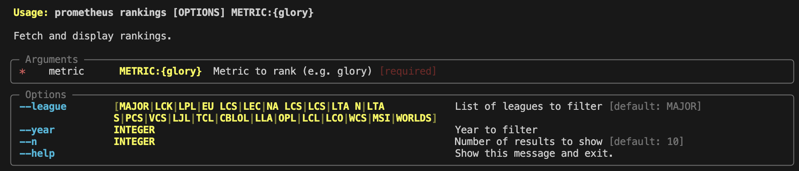

# Prometheus

Prometheus is a database of 'sabermetric' like stats that evaluate League of Legends esports teams and players. The `prometheus` repository will contain a database that records these stats as well as a self-hosted website to browse stats across different teams, seasons, and regions.

An overview of prometheus' stats (described more in the [metrics](#metrics) section):
- **Global League Offensive Rankings Yield (GLORY)**: Prometheus' flagship metric. Weights gold/objectives by their importance in the meta, and calculates the best teams at securing those advantages across all regions.
- **Global League Offensive Rankings Baseline (GLORB)**: Baseline for GLORY. Weights all objective/gold equally.
## CLI
The prometheus CLI provides users the ability to view past of current ratings for any of prometheus' metrics.



For example, the following command will show the top rankings of the `GLORY` metric for all major regions in a given year.

```
$ prometheus rankings glory --league MAJOR --year 2024
┏━━━━━━━━━━━━━━━━━━━━━━━━━━━━━━━━━━━━━━━━━━━━┓
┃ GLORY Rankings (MAJOR | [2024])            ┃
┡━━━━━━━━━━━━━━━━━━━━━━━━━━━━━━━━━━━━━━━━━━━━┩
│               teamname  score  year league │
│ 0                Gen.G  83.60  2024    LCK │
│ 1           G2 Esports  77.11  2024    LEC │
│ 2          Team Liquid  70.83  2024    LCS │
│ 3                   T1  65.70  2024    LCK │
│ 4  Hanwha Life Esports  65.46  2024    LCK │
│ 5               Fnatic  60.97  2024    LEC │
│ 6             FlyQuest  60.41  2024    LCS │
│ 7             Team BDS  57.71  2024    LEC │
│ 8               Cloud9  53.86  2024    LCS │
│ 9            Dplus KIA  53.51  2024    LCK │
└────────────────────────────────────────────┘
```

Provide lists of arguments to filter results for all of those parameters.

```
$ prometheus rankings glory --year 2021 --year 2022 --league LPL --league LCK

┏━━━━━━━━━━━━━━━━━━━━━━━━━━━━━━━━━━━━━━━━━━━━┓
┃ GLORY Rankings (LPL, LCK | [2021, 2022])   ┃
┡━━━━━━━━━━━━━━━━━━━━━━━━━━━━━━━━━━━━━━━━━━━━┩
│               teamname  score  year league │
│ 0                Gen.G  77.18  2022    LCK │
│ 1      FunPlus Phoenix  76.00  2021    LPL │
│ 2  Royal Never Give Up  74.74  2021    LPL │
│ 3          Top Esports  74.40  2021    LPL │
│ 4                   T1  72.67  2022    LCK │
│ 5            Dplus KIA  72.38  2021    LCK │
│ 6        EDward Gaming  64.63  2021    LPL │
│ 7      Invictus Gaming  63.38  2021    LPL │
│ 8            JD Gaming  62.46  2021    LPL │
│ 9               Suning  60.10  2021    LPL │
└────────────────────────────────────────────┘
```

## Goals
- [x] One advanced metric (GLORY) that evaluates team performance
- [ ] One advanced metric that evaluates individual player performance
- [ ] SQL database that stores ~~match~~, player, and ~~stat~~ tables
- [ ] Self-hosted webpage for exploring stat rankings
- [x] CLI for dynamically viewing metrics
- [x] Metrics span 5+ years of data over all major regions
## Metrics
### Team-based
These metrics evaluate the strength of a team. Their main purpose is to compare the strength of a given team compared to teams across regions. 

These metrics are heavily dependent on the strength of opposing teams and the meta. For example, a team that plays during the 2018 skirmish-heavy meta will tend to have higher scores than the control-meta of 2015, regardless of the truth strengths of their team.

To account for this, Prometheus calculates stats based on a per-season basis. Each metric is weighted appropriately for a single season. Thus, teams are scored based on how well they accomplish the goals of that specific "meta". 

Prometheus also includes z-scores to compare the strength of a team relative to other teams in its region. We can calculate which teams were most "dominant" in specific eras. 
#### Global League Offensive Rankings Yield (GLORY)
GLORY is prometheus' flagship stat for team performance. At a high level, it is a weighted sum of basic per-game stats listed below.

```
- GPM = team_gold / game_length_minutes
- GDPM = (team_gold - opponent_gold) / game_length_minutes
- Turrets_per_10 = turrets_taken / (game_length_minutes/10)
- Baron_per_10 = barons_taken / (game_length_minutes/10)
- Dragon_per_10 = dragons_taken / (game_length_minutes/10)
- Objective_conversion_rate = objectives_taken / contested_objectives
```

We also include slightly more advanced metrics in this calculation:

```
- Kill_conversion = fraction of team kills that directly preceded (within X seconds) an objective take
```

In GLORY, weights are calculated using logistic regression with the winning team as a prediction target. 
#### Global League Offensive Rankings Baseline (GLORB)
GLORB is very similar to GLORY, except all categories are weighted equally. It provides a baseline to compare GLORY against and is much easier to implement.
### Player-based
`TBD`
## Implementation
Determining the weights for WOBA involves creating a table where each match has two rows: one for Blue side and one for Red side. The features in a row are the stats described above.

The match data will be stored in an sqlite3 database. Initially, the only table in the database will be a match table that stores the weights for LORB/GLORY. 

When a user requests the metrics for a certain team, region, or split, we will query the database to grab the relevant matches for that metric request. Then, we will fit a model using scikit-learn. The weights for those models will be cached or stored on the disk, depending on the time it fit the model. 

The Prometheus API will return metrics and rankings for use in the CLI and website.
## Challenges
#### Strength-based schedules
Unlike traditional sports, most modern League regions don't follow a traditional round-robin based format for their regular season. For example, here is the LTA North Split 1 season: 


As a team advances farther in the bracket, they face more difficult opponents, which results in worse metrics. Stronger teams that advance farther are "punished" by the metrics for winning their games and moving through the bracket. 

One solution to this problem is to factor in opponent team strength when calculating metrics. This can be simply by using opponent win percentage to adjust scores, or calculating a team's elo. 
#### Disparity in region strength
Weighting by elo will also help the model learn weights that reflect the tendencies of top regions as opposed, which is the ultimate goal of these metrics. Take the following contrived example.

T1 (LCK) is undefeated during the spring split. Every game, they sack all dragons and only focus on taking voidgrubs and heralds. C9 (LCS) is also undefeated. Every game, they sack voidgrubs/heralds and only focus on taking dragons.

Because T1 is playing in a more difficult region, intuitively their games (where top-side is prioritized much more heavily) should 'count' more in the models. Thus, our model should favor teams that are great at taking voidgrubs/heralds over their counterparts that focus on dragons. 

If we weight matches by the opponent's elo, then matches against stronger opponents will count more in the rankings, solving this problem. The difficulty with this is implementing an elo system that works across regions and across the 10+ league seasons.